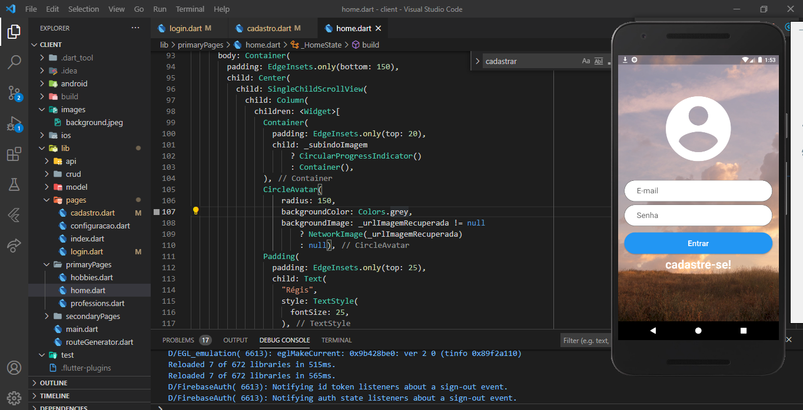
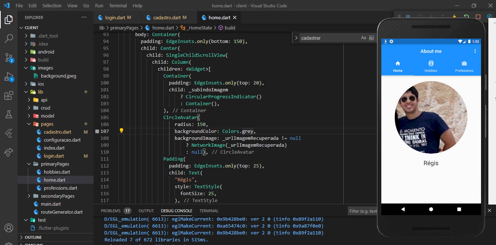
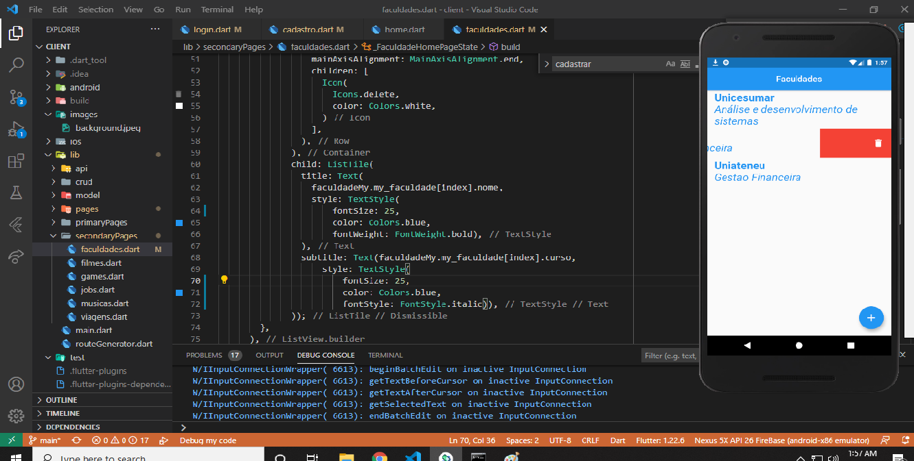

# Django_Flutter_AboutMe

# Django

First Step:

    chacek if you are using virtualenv if you not just use this command below
    python -m venv <name virtual env>
    source venv/<virtual name>/activate
    then
    install dependencies
    pip3 install -r requirements.txt
        
Second Step:

    rename the .env.sample file to .env and run:

Third Step:

    python manage.py migrate

Fourth Step:

    python3 manage.py createsuperuser
  
Finally

    run a command python3 manage.py runserver
    
    
# Flutter

First Step:

    flutter packages get
        
Second Step:

    flutter run

## Login Page

    

## Home Page

## College page with slide iten

